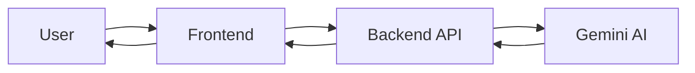

# Lectura Documentation

Comprehensive documentation for the Lectura AI lecture notes generator.

## 📚 Documentation Index

### [API.md](./API.md)
Complete API reference for all backend endpoints.

**Contents:**
- Health check endpoint
- Transcription API
- Summarization API
- Flashcard generation API
- Translation API
- Request/response schemas
- Error handling
- Authentication (if needed)

**Use this for:**
- Frontend integration
- Third-party integrations
- API testing
- Understanding data formats

---

### [ARCHITECTURE.md](./ARCHITECTURE.md)
System architecture and design decisions.

**Contents:**
- System overview
- Component architecture
- Data flow diagrams
- Technology stack rationale
- Scalability considerations
- TOON optimization strategy
- Security measures

**Use this for:**
- Understanding system design
- Making architectural decisions
- Onboarding new developers
- System scaling plans

---

## 📖 Additional Documentation Needs

### For Hackathon Judges

Create `PITCH.md`:
- Problem statement
- Solution overview
- Technical innovation (TOON format)
- Accessibility features
- Demo instructions
- Future roadmap

### For Developers

Create `CONTRIBUTING.md`:
- Code style guide
- Git workflow
- Pull request process
- Testing requirements
- Review checklist

### For Deployment

Create `DEPLOYMENT.md`:
- Railway/Fly.io setup
- Environment variables
- Database setup (if added)
- Domain configuration
- CI/CD pipeline
- Monitoring and logging

## 🎯 Documentation Standards

### Code Comments

**Python (Backend):**
```python
def transcribe_audio(file: UploadFile, language: str) -> TranscribeResponse:
    """
    Transcribe audio file to text using Gemini API.

    Args:
        file: Audio file to transcribe
        language: Target language code (e.g., 'en', 'es')

    Returns:
        TranscribeResponse with transcript and metadata

    Raises:
        ValueError: If file format is not supported
        APIError: If Gemini API call fails
    """
```

**TypeScript (Frontend):**
```typescript
/**
 * Custom hook for audio transcription
 *
 * @returns {Object} Transcription state and methods
 * @property {Function} transcribe - Function to start transcription
 * @property {boolean} loading - Loading state
 * @property {TranscribeResponse | null} data - Transcription result
 * @property {Error | null} error - Error if occurred
 *
 * @example
 * const { transcribe, loading, data } = useTranscribe()
 * await transcribe(audioFile)
 */
```

### README Structure

Each README should have:

1. **Title** - Component/module name
2. **Overview** - What it does
3. **Structure** - Directory/file layout
4. **Quick Start** - Setup instructions
5. **Usage** - How to use
6. **API/Interface** - Public methods/endpoints
7. **Examples** - Code samples
8. **Testing** - How to test
9. **Resources** - Links to docs

### API Documentation

Use OpenAPI/Swagger format:
- Access at `http://localhost:8000/docs`
- Auto-generated from FastAPI
- Include examples
- Document errors

## 🔧 Tools for Documentation

### Backend API Docs
FastAPI automatically generates:
- Interactive API documentation (Swagger UI)
- OpenAPI schema
- ReDoc alternative UI

Access at:
- Swagger UI: `http://localhost:8000/docs`
- ReDoc: `http://localhost:8000/redoc`
- OpenAPI JSON: `http://localhost:8000/openapi.json`

### Frontend Component Docs
Consider adding:
- Storybook for component showcase
- JSDoc comments
- TypeDoc for API reference

### Diagrams

Use Mermaid for diagrams in markdown:



## 📝 Documentation Checklist

### Before Demo
- [ ] API.md is complete
- [ ] ARCHITECTURE.md is complete
- [ ] All README files exist
- [ ] Code has comments
- [ ] Environment variables documented
- [ ] Setup instructions tested
- [ ] Demo script prepared

### For Production
- [ ] DEPLOYMENT.md created
- [ ] Security considerations documented
- [ ] Rate limiting documented
- [ ] Error codes documented
- [ ] Monitoring setup documented
- [ ] Backup/recovery procedures
- [ ] Incident response plan

## 🎓 Learning Resources

### FastAPI
- [Official Tutorial](https://fastapi.tiangolo.com/tutorial/)
- [Advanced User Guide](https://fastapi.tiangolo.com/advanced/)
- [Deployment Guide](https://fastapi.tiangolo.com/deployment/)

### React + TypeScript
- [React Docs](https://react.dev/)
- [TypeScript Handbook](https://www.typescriptlang.org/docs/handbook/intro.html)
- [React TypeScript Cheatsheet](https://react-typescript-cheatsheet.netlify.app/)

### Gemini API
- [Getting Started](https://ai.google.dev/tutorials/get_started_web)
- [API Reference](https://ai.google.dev/api)
- [Best Practices](https://ai.google.dev/docs/best_practices)

### Tailwind CSS
- [Documentation](https://tailwindcss.com/docs)
- [UI Components](https://tailwindui.com/)
- [Component Examples](https://www.hyperui.dev/)

## 🤝 Contributing to Docs

When adding features:

1. **Update API.md** if adding endpoints
2. **Update README.md** in relevant directory
3. **Add code comments** for complex logic
4. **Update ARCHITECTURE.md** for design changes
5. **Add examples** for new functionality
6. **Update this index** if adding new docs

## 📊 Documentation Metrics

Track documentation quality:
- Code coverage of comments
- API endpoint documentation completeness
- README completeness per directory
- Example code coverage
- Outdated documentation detection

## 🚀 Quick Links

- [Backend README](../backend/README.md)
- [Frontend README](../frontend/README.md)
- [Main README](../README.md)
- [CLAUDE.md](../CLAUDE.md) - Hackathon plan
- [API Docs (when running)](http://localhost:8000/docs)
